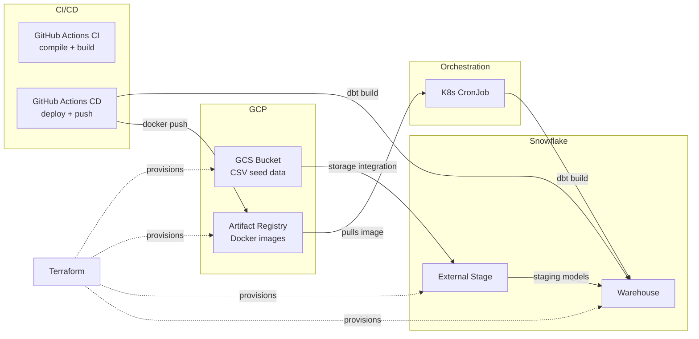

# Superstore

A learning project for building a modern data stack using dbt, Snowflake, Terraform, GCP and Kubernetes.

## Design



## Getting Started

### Tools

### justfile
- `brew install just`
- `just -l`

### uv
- `brew install uv`
- `uv sync`
- `uv lock`

### Docker
- `brew install docker`

### Terraform
- `brew tap hashicorp/tap`
- `brew install hashicorp/tap/terraform`

### Snowflake Key Pair Authentication
Generate a private key (unencrypted):
```bash
openssl genrsa 2048 | openssl pkcs8 -topk8 -inform PEM -out rsa_key.p8 -nocrypt
```

Generate a public key:
```bash
openssl rsa -in rsa_key.p8 -pubout -out rsa_key.pub
```

In Snowflake, grant the [proper privileges](https://docs.snowflake.com/en/user-guide/key-pair-auth#grant-the-privilege-to-assign-a-public-key-to-a-snowflake-user) to your user:
```sql
GRANT MODIFY PROGRAMMATIC AUTHENTICATION METHODS ON USER skillicinski
  TO ROLE ACCOUNTADMIN;
```

Then, [assign a public key](https://docs.snowflake.com/en/user-guide/key-pair-auth#assign-the-public-key-to-a-snowflake-user) to the right user:
```sql
ALTER USER skillicinski SET RSA_PUBLIC_KEY='MIIBIjANBgkqh...';
```

Run `just setup` for setting up a local `.env` with your Snowflake credentials and creating Github Secrets used by Actions in CI/CD.

## IaC

Terraform providers are set up for Snowflake and Google. The configuration provisions a warehouse, database, schemas and integration with Google Cloud Storage in Snowflake. It also deploys an Artifact Registry and Storage Bucket with raw data in Google Cloud Storage. This allows the dbt Snowflake adapter to materialize all its models from CSVs in cloud storage, `dbt seed` can be used as a backup solution for exploration in Snowflake if the integration fails (experimental Terraform feature)

## Docker

A Dockerfile collects the project functionality in a container. It can be built and tested locally with `just docker-build` and `just docker-test`. A manual recipe exists for pushing the image to the Artifact Registry, `just docker-push`.

## CI/CD

Github Actions trigger a CI workflow on pushes and PRs to main. The workflow runs `dbt compile` to catch any obvious issues with rendering the project, then attempts to build the project container.

On merges to `main`, the CD workflow is triggered.

### Future improvement

The CI workflow could use the `manifest.json` from previous CD workflow runs. This can then be used to run a `dbt build` command for rebuilding only changed models (since the previous run) in the next CI workflow run. These models can be built against a numbered PR-specific schema using a separate dbt profile. A final step of the CI workflow would then be to drop this schema if the build succeeds.

## Orchestration

A Kubernetes CronJob schedules the dbt project to build at 6 AM UTC when it is hosted in a cluster. The Kubernetes Job could also be called by an external orchestrator, eg. Airflow, Dagster, Airbyte, etc.